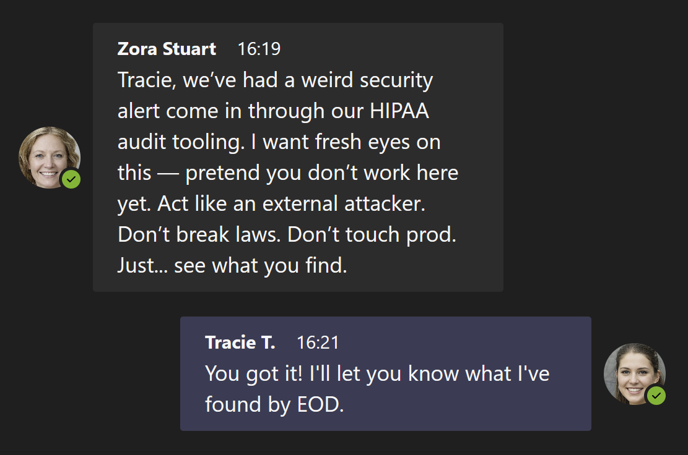

# Operation Second Opinion - Carrum Health
Date: May 22, 2025

Author: Tracie T.

---

## 🧩 Background

Carrum Health is a value-based healthcare platform connecting self-insured employers with surgical care providers. The platform handles sensitive patient data, including medical documents, personal health information (PHI), and personally identifiable information (PII)

## 🍻 Objective

As part of my early orientation into the security team here, I was asked to approach the platform with fresh eyes, simulating how an external threat actor might evaluate the patient-facing upload workflow. I have been asked to identify potential vulnerabilities and recommend mitigations without accessing production systems.

## 🛠️ Scope

- In-Scope:
  - Patient document upload feature
  - Associated APIs and storage mechanisms
  - User authentication and authorization flows
- Out-of-Scope:
  - Internal administrative dashboards
  - Third-party integrations not related to file uploads

## Notes

- For methodology details, please see the disclaimer in the project README.